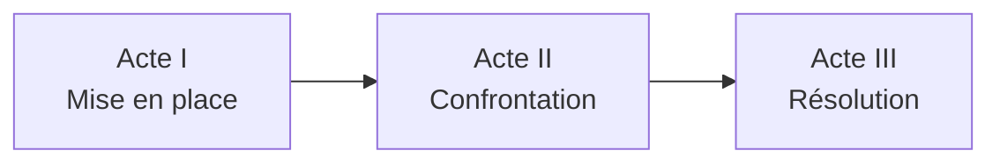
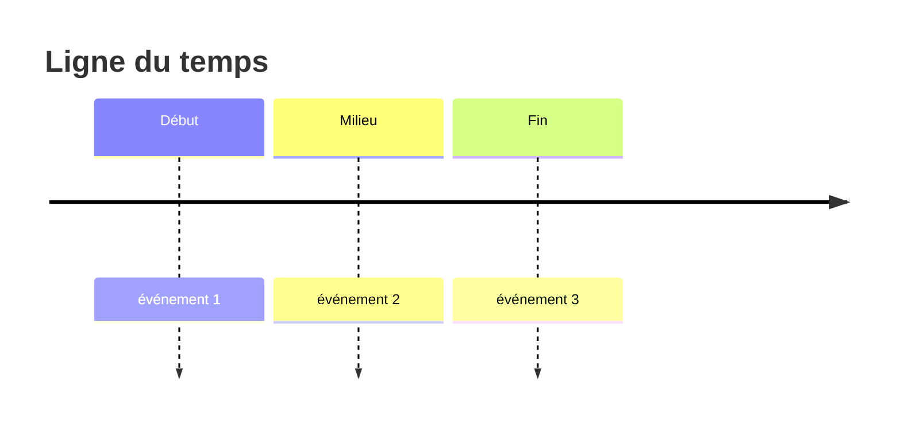

# 🗺️ Plan général

## Structure du récit

## Arcs narratifs

### Arc principal
*— Description —*

| Étape | Chapitre | Description |
|-------|----------|-------------|
| Exposition | | |
| Incident déclencheur | | |
| Premier pivot | | |
| Point médian | | |
| Pivot sombre | | |
| Climax | | |
| Dénouement | | |

### Sous-arcs
<!-- Ajoute autant de lignes que nécessaire -->
- **Arc 2 :** *
- **Arc 3 :** *

## Chronologie

## Notes de structure

*
