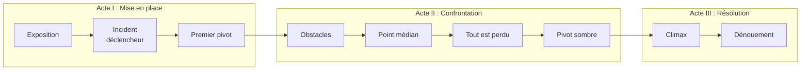

# 🎭 Arc narratif

## Structure en 3 actes

---

## Acte I — Le départ

| Étape | Chapitre | Ce qui se passe |
|-------|----------|----------------|
| 🌍 **Exposition** | | Monde normal, présentation du héros |
| 🔥 **Incident déclencheur** | | L'événement qui lance tout |
| 🚪 **Premier pivot** | | Le héros passe la porte, plus de retour possible |

**Tension :** 📈

## Acte II — L'initiation

| Étape | Chapitre | Ce qui se passe |
|-------|----------|----------------|
| ⚔️ **Obstacles** | | Défis, alliés, ennemis |
| 🔄 **Point médian** | | Fausse victoire ou grande révélation |
| 💔 **Tout est perdu** | | Pire moment pour le héros |
| 🌅 **Pivot sombre** | | Prise de conscience, dernière préparation |

**Tension :** 📈📈

## Acte III — Le retour

| Étape | Chapitre | Ce qui se passe |
|-------|----------|----------------|
| ⚡ **Climax** | | Confrontation finale |
| 🕊️ **Dénouement** | | Retour à la normale, mais changé |

**Tension :** 📈📈📈 → 📉

---

## Rythme

| Acte | % du récit | Nb de chapitres estimé |
|------|-----------|----------------------|
| Acte I | ~25% | |
| Acte II | ~50% | |
| Acte III | ~25% | |

## Sous-intrigues

1. **Titre :** * | Liée à : * | Résolution : *
2. **Titre :** * | Liée à : * | Résolution : *

## Émotions dominantes par acte

- **Acte I :** Curiosité, attachement
- **Acte II :** Tension, espoir, désespoir
- **Acte III :** Soulagement, satisfaction

---

## Inspirations

> *
