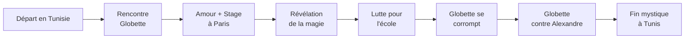

# 📖 La Magicienne — Structure du roman

> [[Synopsis]] | [[Plan général]] | [[Progression]]

---

## Synopsis

Alexandre, homme d'affaires rêveur qui ne court ni après l'argent ni après le succès, décide de partir sur les traces de ses parents dans leur pays natal, la Tunisie, malgré leurs avertissements. Sur place, il rencontre Globette, une secrétaire en apparence ordinaire mais qui est en réalité une fée cachée parmi les humains. Leur histoire d'amour va bouleverser non seulement leur existence, mais aussi l'équilibre du monde — car Globette, connectée à la terre de ses origines, influence le destin du monde sans le savoir.

---

## 👥 Personnages principaux

| # | Personnage | Rôle | Description |
|---|-----------|------|-------------|
| 1 | **Alexandre** | Protagoniste | Homme d'affaires rêveur, cherche liberté et amour |
| 2 | **Globette** | Fée / Amour | Fée cachée, secrétaire, lien magique avec le monde |
| 3 | **Djamel** | Partenaire tunisien | Accueille Alexandre à Tunis |
| 4 | **Fathi** | Chauffeur / Passeur | Magicien protecteur, guide des fées |
| 5 | **Jihene** | Mère de Globette | Sorcière en amour, 3 enfants, mari parti |
| 6 | **Geniette** | Fée-sorcière | Amie de Globette, bascule entre lumière et obscurité |
| 7 | **Anice** | Ex de Globette | Magicien au grand cœur, ancien amour de Globette |
| 8 | **Daly** | Associé sécurité | Partenaire sur MagProtect, tensions avec Globette |
| 9 | **Hervé** | Investisseur | Se retire du projet, dégoûté |
| 10 | **Serge Beurk** | Manipulateur | Homme d'affaires qui manipule Globette contre Alexandre |
| 11 | **Père d'Alexandre** | Famille | Tombe malade, Alexandre devient aidant |
| 12 | **Fille d'Alexandre** | Famille | Aide son père à retrouver ses marques |
| 13 | **Sœur de Globette** | Famille | Présente à la fin |
| 14 | **Père de Globette** | Famille | Impuissant face à la situation |
| 15 | **Professeur école** | Secondaire | Demande à être payé |

---

## 📑 Résumé des chapitres

### Acte I — La Rencontre (ch. 1-12)

| Chap | Résumé |
|------|--------|
| **1** | Alexandre, homme d'affaires rêveur en quête de liberté et d'amour, décide de partir en Tunisie malgré l'opposition de ses parents. |
| **2** | Arrivé à Tunis, Djamel l'accueille et le dépose à l'hôtel Résidence ; le parfum du jasmin lui rappelle son enfance. Au bureau, il rencontre Globette, une secrétaire qui est en réalité une fée. |
| **3** | Premier contact amoureux, soirée magique, découverte de la maison parentale d'Alexandre devenue maison de retraite pour pauvres. Le rapprochement avec Globette grandit alors qu'Alexandre doit rentrer. |
| **4** | Séparation au départ. Alexandre ne pense qu'à Globette, leurs conversations en ligne deviennent de plus en plus intimes. Laurent propose à Globette un stage de 6 mois dans son entreprise à Paris. |
| **5** | Arrivée à Paris : la maison d'Alexandre, le bureau, la mise en place du stage. |
| **6** | Premier jour de stage. Globette découvre un nouveau monde. Alexandre joue le grand jeu : restaurants, cadeaux, amour. |
| **7** | Premiers rendez-vous clients, stratégie d'entreprise. Paris avec ses rues, sa tendresse et sa vérité parfois dure. |
| **8** | Premier contrat signé dans le médical. Nouveaux contacts de Globette. L'école de Tunis montre des signes de faiblesse de la part de Djamel. |
| **9** | Globette, nostalgique de son pays, retourne à Tunis pour gérer les problèmes de l'école, avec des valises de cadeaux pour sa famille. |
| **10** | Alexandre n'en peut plus d'être séparé d'elle. Il décide de la rejoindre en Tunisie. |
| **11** | Fathi, le chauffeur passeur de fées, accueille Alexandre. Retrouvailles au café "Gourmandise de fée" à La Marsa. L'école est au bord du gouffre : le directeur est parti avec les élèves. |
| **12** | Arrivée à l'école dévastée. Mise en place d'un avocat contre l'ancien directeur. Présentation de Jihene, la mère sorcière de Globette. |

### Acte II — L'Engrenage (ch. 13-26)

| Chap | Résumé |
|------|--------|
| **13** | Grosse chaleur, recrutement d'un nouveau directeur, campagne de pub avec peu de moyens. Obligés de quitter l'école. Le propriétaire refuse de rendre la caution. Globette se révèle à Alexandre : ses ailes apparaissent. |
| **14** | Le monde de Globette vu par les yeux d'Alexandre. |
| **15** | Alexandre décide de lancer l'école sur Internet. Globette, enthousiaste, en fait la promotion dans le monde caché. |
| **16** | Alexandre doit rentrer mais sent que Globette est différente chez elle. Le monde va bien quand elle est dans son pays. Il rentre seul. |
| **17** | Le 1er janvier, Alexandre apprend la fin de sa mission chez son seul client, un ami de 8 ans. Globette rentre le soutenir. Il remarque que le parfum de sa peau a changé. |
| **18** | Globette présente Dali (sécurité). Elle reçoit une obligation de quitter le territoire mais refuse. Alexandre fait appel à un avocat. Globette ne peut plus rentrer chez elle. |
| **19** | Alexandre monte MagProtect. Les investisseurs se détachent de l'école. Globette rencontre Geniette, fée et sorcière à la fois. Alexandre voit Globette changer, devenir matérialiste. |
| **20** | Alexandre se bat pour que Globette puisse rester. Son père tombe gravement malade. Il surprend un jeune homme chez Globette. La situation s'envenime, Alexandre se retrouve seul. |
| **21** | La fille d'Alexandre l'aide à retrouver ses marques. Nouveaux clients. Globette rappelle, explique qu'elle était perdue. Jihene conseille une réconciliation. Les autorisations de MagProtect arrivent. |
| **22** | Anice, l'ex de Globette et magicien au grand cœur, donne des conseils à Alexandre pour garder Globette. |
| **23** | Alexandre, Globette et Dali lancent MagProtect. Tensions entre Dali et Globette. Le monde va de pire en pire : lien direct avec l'éloignement de Globette de ses racines. |
| **24** | *—* |
| **25** | Premier contrat MagProtect. Globette trouve l'agent non conforme. Problèmes entre Dali et Globette qui découragent les investisseurs. |
| **26** | Dali monte sa boîte en parallèle. Hervé se retire. Le monde empire. Globette devient agressive et menaçante. Alexandre ne tient plus rien. |

### Acte III — La Déchirure (ch. 27-39)

| Chap | Résumé |
|------|--------|
| **27** | Alexandre, sentant Globette s'éloigner, propose de n'avoir plus qu'une relation professionnelle. Son père entre à l'hôpital en urgence. |
| **28** | Le père d'Alexandre, cancer du foie. Alexandre devient son aidant. Globette se rapproche du père. Alexandre lance un Airbnb avec son aide. |
| **29** | Le Airbnb fonctionne. Alexandre et Globette se rapprochent mais leur amour devient purement sexuel, sans tendresse. |
| **30** | Globette est enceinte. Elle ne veut pas le garder car Alexandre n'est pas un magicien. Alexandre l'accompagne dans la procédure d'avortement, dévasté. |
| **31** | L'avortement les rapproche dans la perte. La magie de Globette ne marche plus, son visage s'est terni. Alexandre lui conseille de rentrer, elle refuse. |
| **32** | Geniette manipule Globette en sorcière. Globette ne voit plus Alexandre que comme un portefeuille. Elle commence à utiliser sa magie pour le manipuler. |
| **33** | Alexandre rêve et comprend la corrélation entre les événements du monde et sa relation avec Globette. |
| **34** | Alexandre va chez Globette pour la convaincre de rentrer en Tunisie. Elle refuse. Il propose de venir vivre avec elle là-bas. Elle est ailleurs, même sa magie ne lui dit plus rien. Il abandonne. |
| **35** | Globette appelle : le père d'Alexandre arrive en surprise. L'ascenseur se bloque. |
| **36** | Globette ne demande que de l'argent à Alexandre pour son père. Alexandre, dégoûté, s'exécute en repensant à la Globette d'avant. |
| **37** | Globette ne vient plus au bureau, elle est avec Geniette. Alexandre rencontre Serge Beurk, un homme d'affaires louche. Il sent que Globette va finir dans ses bras. |
| **38** | Beurk manipule Globette contre Alexandre. Alexandre l'avertit mais elle ne l'écoute pas. |
| **39** | Le monde retourne à la normale. Alexandre reçoit une convocation de la gendarmerie : Globette a porté plainte. Beurk le menace. Alexandre est entendu par la police, qui le croit. |

### Acte IV — La Fin (ch. 40)

| Chap | Résumé |
|------|--------|
| **40** | Alexandre retourne à Tunis. Fathi le conduit dans les lieux de son histoire avec Globette. Au café, le serveur lui apprend que Globette est mourante. Alexandre court chez Jihene. Globette, alitée, l'attend. Elle l'embrasse une dernière fois, des ailes lumineuses les enveloppent, et ils disparaissent ensemble, laissant un arc-en-ciel partir de la maison vers le ciel. |

---

## 🎭 Les 4 Actes

| Acte | Titre | Chapitres | Résumé |
|------|-------|-----------|--------|
| I | **La Rencontre** | 1-12 | Installation, découverte de la magie |
| II | **L'Engrenage** | 13-26 | Tensions, manipulation, éclatement |
| III | **La Déchirure** | 27-39 | Déclin, tragédies, ruptures |
| IV | **La Fin** | 40 | Dénouement à Tunis, disparition mystique |

---

## 🌍 Thèmes principaux

1. **L'amour impossible** — entre un humain et une fée
2. **La liberté** — Alexandre fuit l'argent pour la liberté
3. **Les racines** — le pays d'origine comme source de vie
4. **Le sacrifice** — Alexandre donne tout pour Globette
5. **La corruption de l'âme** — Globette s'éloigne de ses racines et se perd
6. **Le lien avec la nature** — Globette connectée au monde, son bonheur fait le bien du monde
7. **La rédemption** — la fin mystique, la fusion des âmes

---

## 🔄 Structure narrative

