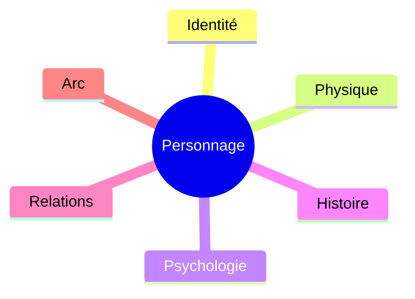

# Template Personnage

---

# [PRÉNOM] [NOM]

**Alias :** *
**Rôle :** Protagoniste / Antagoniste / Secondaire / Figurant
**Statut :** Actif / En sommeil / Disparu / Décédé
**Inspiration :** *

---

## 🆔 Identité

| Champ | Valeur |
|-------|--------|
| Nom complet | |
| Âge | |
| Date de naissance | |
| Lieu de naissance | |
| Nationalité | |
| Profession | |
| Situation familiale | |

## 👤 Apparence

- **Taille :** *
- **Cheveux :** *
- **Yeux :** *
- **Signe distinctif :** *
- **Style vestimentaire :** *

## 🧠 Psychologie

- **Traits positifs :** *
- **Traits négatifs :** *
- **Peurs :** *
- **Désirs / Motivations :** *
- **Défaut principal :** *
- **Phobie :** *

## 📖 Histoire

### Avant l'histoire

*

### Pendant l'histoire

*

## 🔗 Relations

| Personnage | Lien | Sentiment |
|------------|------|-----------|
| [[*]] | * | * |
| [[*]] | * | * |

## 📈 Arc du personnage

- **Point de départ :** *
- **Évolution :** *
- **Point d'arrivée :** *

## 🎭 Citations

> *

---

## Notes libres

*
